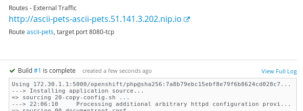

:toc:

= LAB Guide

[NOTE]
This lab guide is intended for learning the project, and running though things on your own. If you already know this project, and are showing other people, you might want to use the link:DEMO.adoc[demo guide] :-)

= Deploy the source code into a container

Create an OpenShift project for this lab called "ascii-pets"

== Add a PHP builder image, using PHP version 7.1.

Select "PHP" from the Service Catalog, and you should see a wizard that looks like this; 

On the second page of this wizard, complete the following, and click CREATE;

* **Version:** (latest)
* **Application Name:** `ascii-pets`
* **Git Repository**: `https://github.com/jamesread/php-ascii-pets.git`

After the build has been created, continue to the overview. 

== Watch the build complete

The source code will now be automatically cloned from GitHub, detected as a PHP, and built into a container. 

== Wait for the application to deploy; 

As soon as the build has completed, a deployment of this container should happen for you. 

image::images/deploy.png[]

== Check out the "ascii-pets" route

image::images/route.png[]

You should get a page that looks like this; 

image::images/deployed.png[]

That's your first app running on OpenShift!

= Make some changes

== Scale up

Back on the project overview page, click on the little "Up" button to scale this deployment to more containers. Scale up to 4x containers and wait for the deployment to finish, and refresh the application's main page. 

image::images/scaleUp.png[]

You may need to disable cookies, so that OpenShift’s router does not stick you to a single session.

The hostname will change randomly between requests, as OpenShift is balancing requests to each pod. The pet displayed on the page is based on the hostname.

== Enable GitHub Link

Let's make a simple configuration change. We are going to set the simple environment variable `SHOW_GITHUB_LINK`, on the DeploymentConfig of this application. The DeploymentConfig, as the name suggests, controls the settings for the application being deployed.

Note that you may have to redeploy the application for the change to take effect. You should see a GitHub link appear on the main application page. 

== Enable dogs :-) (optional!)

You can do the same again, and if you set the environment variable `PET_TYPE` to `dogs`, then your pet type will be changed accordingly!

== Try setting the environment variable via a ConfigMap

Look at Config Maps under Resources. A Config Map makes managing several settings at once a little easier. 

Remove the environment variables from the deployment config, and add them into a Config Map instead.

= Where can I go from here?

Check out more OpenShift demos, or play around with the deployment of this app a bit more and familiarize yourself with OpenShift ;)

* link:https://github.com/city-breaks-on-openshift[City Breaks on OpenShift]
