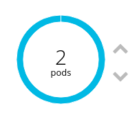

:toc:

= LAB Guide

[NOTE]
This lab guide is intended for learning the project, and running though things on your own. If you already know this project, and are showing other people, you might want to use the link:DEMO.adoc[demo guide] :-)

= Deploy the source code into a container

Create an OpenShift project for this lab called "ascii-pets"

== Add a PHP builder image, using PHP version 7.1.

* **Application Name:** `ascii-pets`
* **Git Repository**: `https://github.com/jamesread/php-ascii-pets.git`

== Watch the build complete

image::images/build.png[]

== Wait for the application to deploy; 

image::images/deploy.png[]

== Check out the "ascii-pets" route

image::images/route.png[]

You should get a page that looks like this; 

image::images/deployed.png[]

That's your first app running on OpenShift!

= Make some changes

== Scale up

You may need to disable cookies, so that OpenShift’s router does not stick you to a single session.

The hostname will change randomly between requests, as OpenShift is balancing requests to each pod. The pet displayed on the page is based on the hostname.

== Enable GitHub Link

You need to set the environment variable “SHOW_GITHUB_LINK”, on the DeploymentConfig…

Note that you will have to redeploy the DeploymentConfig for the change to take effect.

== Enable dogs :-) (optional!)

If you set the environment variable `PET_TYPE` to `dogs`, then your pet type will be changed accordingly!

== Try setting the environment variable via a ConfigMap

ConfigMaps make configuration more manageable at scale.

== Try A/B testing

Deploy a new PHP app, but this time using the `feature_border` branch from GitHub (you’ll need to switch to “advanced” in the deployment view.

Do not deploy a new route. 

Adjust the existing route to point to the new service on a 60%/40% split. 

Refresh lots of times in your browser :)

= Where can I go from here?

Check out more OpenShift demos, or play around with the deployment of this app a bit more and familiarize yourself with OpenShift ;)

* https://github.com/city-breaks-on-openshift
