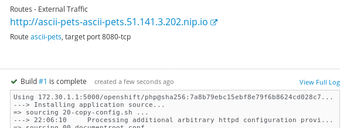
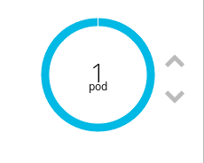
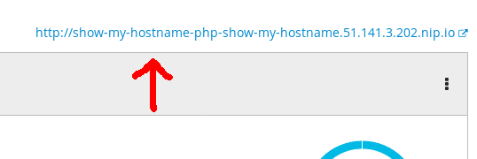
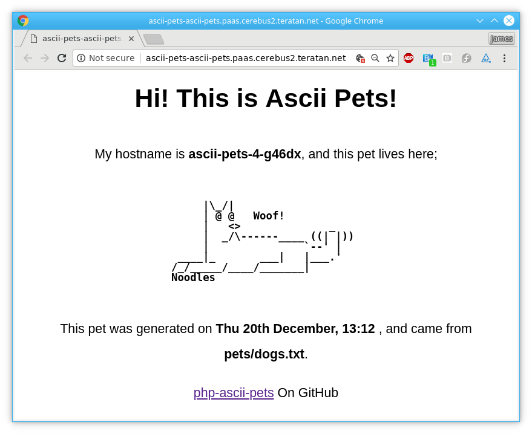
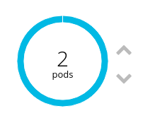

:toc:

= php-ascii-pets

= What is this?

This is a super simple application that can showcase simple OpenShift concepts very quickly. It's intented as a "I know nothing about OpenShift" level of demo, and teaches routes, services, deployments and builds in about 15 minutes.

= What do I need before I get started?

A working OpenShift environment. That's all!

= What will I do in this tutorial?

* Build and deploy a simple single-service application.
* Make a few configuration changes. 
* Learn basic openshift concepts.

= Create a project

Create an OpenShift project called "ascii-pets"

== Add a PHP builder image, using PHP version 7.1.

* **Application Name:** `ascii-pets`
* **Git Repository**: `https://github.com/jamesread/php-ascii-pets.git`

== Watch the build complete

== Wait for the application to deploy; 

== Check out the "ascii-pets" route

You should get a page that looks like this; 

That's your first app running on OpenShift!

== Scale up

Note: OpenShift’s router will make sessions sticky by default by sessing a cookie. Try deleting the cookie, or using “curl” (which won’t save cookies) to see how OpenShift balances traffic.

Remember to disable cookies, so that OpenShift’s router does not stick you to a single session.

The hostname will change randomly between requests, as OpenShift is balancing requests to each pod. The background color of the page is based on the hostname.

== Enable GitHub Link

You need to set the environment variable “SHOW_GITHUB_LINK”, on the DeploymentConfig…

Note that you will have to redeploy the DeploymentConfig for the change to take effect.

== Try setting the environment variable via a ConfigMap

ConfigMaps make configuration more manageable at scale.

== Try A/B testing

Deploy a new PHP app, but this time using the `feature_border` branch from GitHub (you’ll need to switch to “advanced” in the deployment view.

Do not deploy a new route. 

Adjust the existing route to point to the new service on a 60%/40% split. 

Refresh lots of times in your browser :)

== More complex deployments (more on this later)

=== Deploy “Node.js + MongoDB (Persistent)”

Notice the two pods connected to each other.

=== Deploy “Pipeline Build Example”.

This includes a Jenkins server, with pipelines setup.

